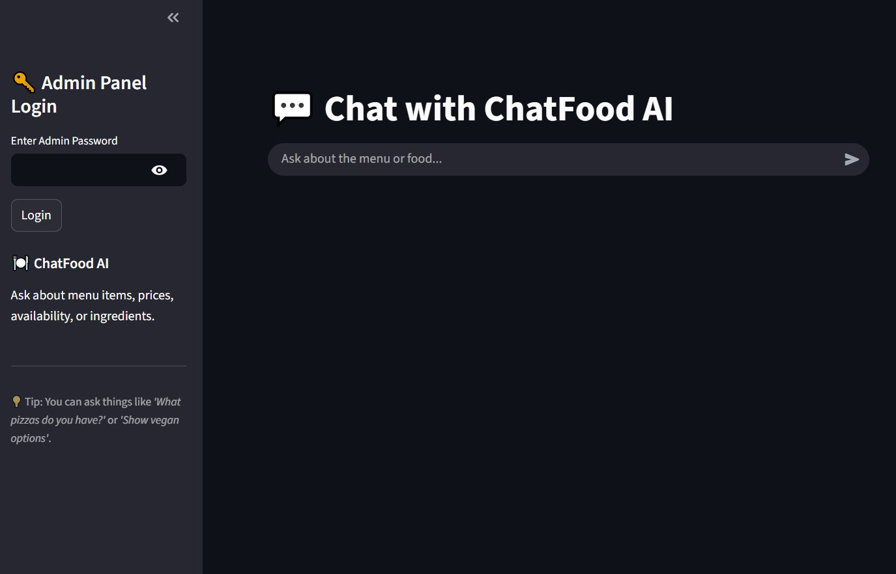
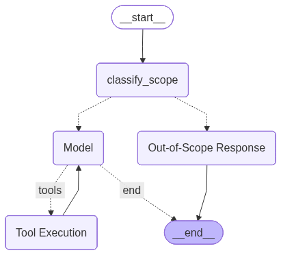
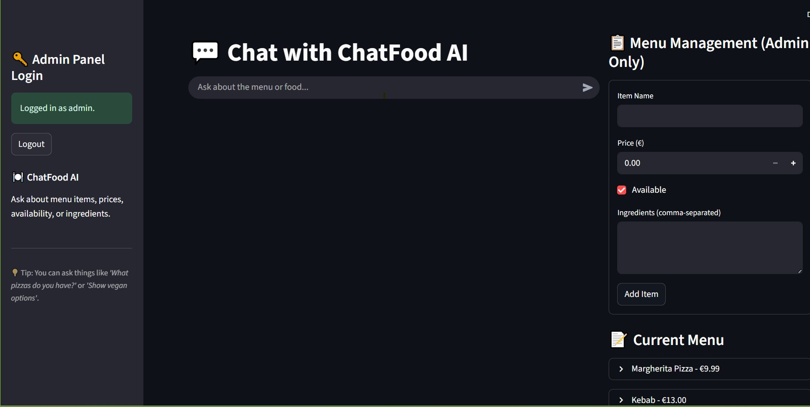
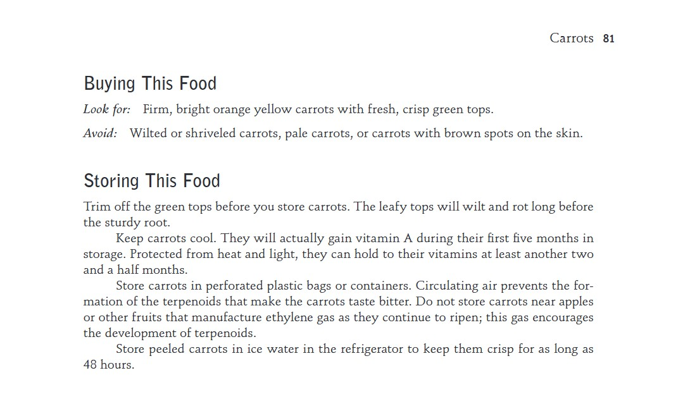
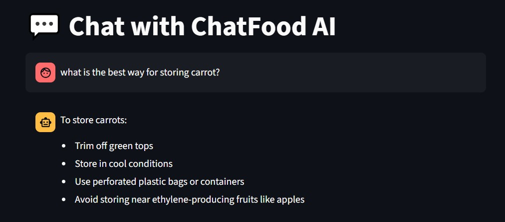
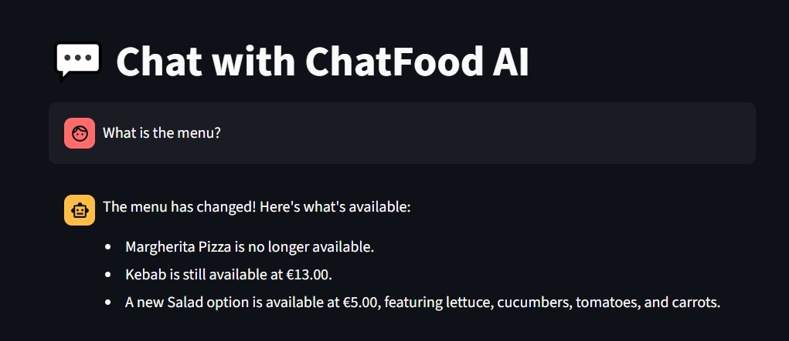

# ChatFood AI: Smart Food &amp; Info Assistant

ChatFood-AI is an intelligent conversational agent for the food domain. It can answer questions about the restaurant menu that it supports, cooking, and food-related topics, while handling out-of-scope queries gracefully. The agent integrates LLM reasoning, tool execution, and memory-based conversational context to provide relevant, interactive responses.

## Features

- **Query Filtering:** Automatically classifies user queries as in-scope (related to food/restaurants/cooking) or out-of-scope.

- **Conversational AI:** Uses a large language model (LLM) with tool integration for interactive responses.

- **Tool Execution:** Can perform predefined actions/tools in response to user queries.

- **Session Memory:** Supports thread-based memory to maintain context across multiple messages.

- **Out-of-Scope Handling:** Provides a polite message when queries are unrelated to the domain.

- **Information Extraction with RAG:** Retrieves relevant information from documents using **Retrieval-Augmented Generation (RAG)**. If the information is not found in the vector database, the agent automatically performs a **web search using Tavily**.

- **Graph-Based Workflow:** Implements the agent logic using a state-machine-based graph, making the workflow clear and modular.

## Agent Workflow

The ChatFood-AI agent is built using a **graph-based workflow**, which allows clear modularity and conditional logic for handling user queries.  

The workflow consists of the following nodes:

1. **Query Filter Node:** Classifies user queries as **in-scope** (related to food, restaurants, or cooking) or **out-of-scope**.  
2. **Main Agent Node (Call Model):** Handles in-scope queries using the LLM and decides if tool execution is required.  
3. **Tool Execution Node:** Executes external tools if the model requests additional actions.  
4. **Out-of-Scope Node:** Provides a polite response if the query is unrelated to the domain.  
5. **Session Memory:** Maintains conversational context across multiple messages via thread-based memory.

Below is the **visual representation** of the workflow:

- The edges between nodes are **conditional**, meaning the agent dynamically chooses the next node based on query relevance and tool usage.  
- This graph helps understand the **decision-making process** of the agent from user input to final response.

## Menu Management Access

The ChatFood-AI system also provides a **Menu Management interface** for restaurant staff.  
This interface allows users to **view, update, and manage menu items** efficiently.

## Example Usage

### 1. Information Extraction from PDF
The agent can extract relevant information from documents.  
Below is an example where the model retrieves data using **RAG** alongside the PDF page content:

### 2. Asking About the Menu
The agent can answer menu-related queries, providing details about available items and options:

